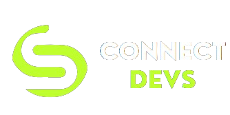

## Work together instantly on projects and hackathons: Use Connect Devs to find your ideal partners.

## Tech Stack

ConnectDevs is built using the following technologies:

- [React.js](https://Reactjs.org/) - library for web and native user interfaces
- [postgresql](https://www.mongodb.com/) - a NoSQL database
- [Tailwind CSS](https://tailwindcss.com/) - a utility-first CSS framework
- [Django] 

Features 

-  map interface that shows the location of developers
- 
- 
- 
- 

## Support

Don't forget to leave a star ⭐️.

